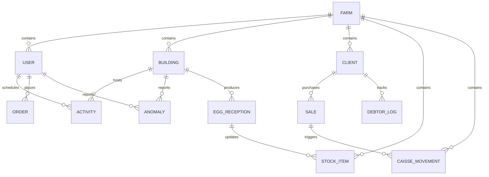
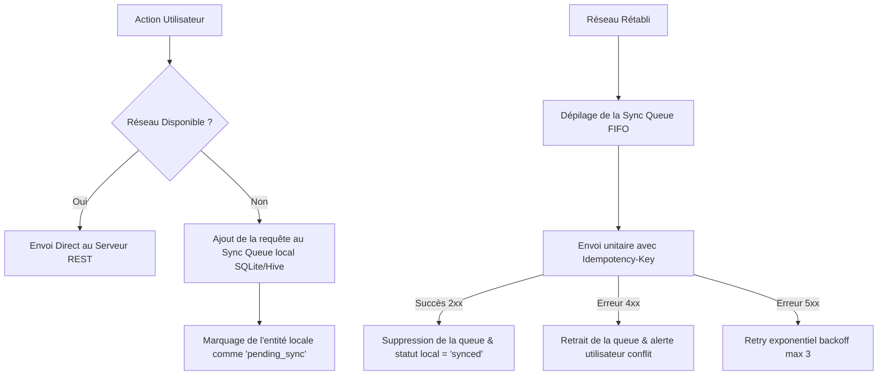

# Spécifications API REST exhaustives — FermeTrack

Ce document contient l'intégralité des spécifications techniques de l'API REST de l'application **FermeTrack**. Chaque endpoint comprend l'URL, la méthode HTTP, les headers requis, les paramètres d'URL ou de requête, ainsi que les structures JSON détaillées pour les requêtes (payload) et les réponses de succès et d'erreur.

---

## 1. Modèle Physique de Données (Relations SQL)



---

## 2. Authentification & Gestion de la Session

### A. Connexion de l'Utilisateur
*   **Verb / Path** : `POST /api/v1/auth/login`
*   **Headers** :
    - `Content-Type: application/json`
*   **Request Payload** :
    ```json
    {
      "username": "magasinier",
      "password": "strongpassword123"
    }
    ```
*   **Response (200 OK)** :
    ```json
    {
      "accessToken": "eyJhbGciOiJIUzI1NiIsInR5cCI6IkpXVCJ9.eyJ1c2VySWQiOiJ1LTk5MTIiLCJyb2xlIjoibWFnYXNpbmlleSJ9...",
      "refreshToken": "ref_88921a998822bc",
      "expiresAt": "2026-09-24T11:16:19Z",
      "user": {
        "id": "u-9912-ab",
        "username": "magasinier",
        "email": "yao@fermetrack.com",
        "fullName": "Yao B.",
        "role": "magasinier",
        "farmId": "farm-112",
        "isActive": true
      }
    }
    ```
*   **Error Response (401 Unauthorized)** :
    ```json
    {
      "errorCode": "INVALID_CREDENTIALS",
      "message": "Nom d'utilisateur ou mot de passe incorrect."
    }
    ```

### B. Déconnexion de l'Utilisateur
*   **Verb / Path** : `POST /api/v1/auth/logout`
*   **Headers** :
    - `Authorization: Bearer <accessToken>`
*   **Response (204 No Content)**.

### C. Rafraîchissement du Jeton d'Accès
*   **Verb / Path** : `POST /api/v1/auth/refresh`
*   **Request Payload** :
    ```json
    {
      "refreshToken": "ref_88921a998822bc"
    }
    ```
*   **Response (200 OK)** :
    ```json
    {
      "accessToken": "eyJhbGciOiJIUzI1NiIsInR5...",
      "refreshToken": "ref_99211aa8823bca",
      "expiresAt": "2026-09-24T12:16:19Z"
    }
    ```

---

## 3. Gestion de la Ferme & des Bâtiments (Directeur / Admin)

### A. Créer une Ferme
*   **Verb / Path** : `POST /api/v1/farms`
*   **Headers** :
    - `Authorization: Bearer <accessToken>`
    - `Content-Type: application/json`
*   **Request Payload** :
    ```json
    {
      "name": "Ferme Akoupé",
      "location": "Région de la Mé, Côte d'Ivoire"
    }
    ```
*   **Response (201 Created)** :
    ```json
    {
      "id": "farm-akoupe-1",
      "name": "Ferme Akoupé",
      "location": "Région de la Mé, Côte d'Ivoire",
      "createdAt": "2026-08-24T11:48:40Z"
    }
    ```

### B. Obtenir les détails de la Ferme
*   **Verb / Path** : `GET /api/v1/farms/{id}`
*   **Headers** :
    - `Authorization: Bearer <accessToken>`
*   **Response (200 OK)** :
    ```json
    {
      "id": "farm-akoupe-1",
      "name": "Ferme Akoupé",
      "location": "Région de la Mé, Côte d'Ivoire",
      "createdAt": "2026-08-24T11:48:40Z"
    }
    ```

### C. Ajouter un Bâtiment dans une Ferme
*   **Verb / Path** : `POST /api/v1/farms/{farmId}/buildings`
*   **Headers** :
    - `Authorization: Bearer <accessToken>`
    - `Content-Type: application/json`
*   **Request Payload** :
    ```json
    {
      "name": "Bâtiment A",
      "birdsCount": 3200
    }
    ```
*   **Response (201 Created)** :
    ```json
    {
      "id": "b-01-a",
      "farmId": "farm-akoupe-1",
      "name": "Bâtiment A",
      "birdsCount": 3200,
      "state": "Stable",
      "createdAt": "2026-08-24T11:49:00Z"
    }
    ```

### D. Lister tous les Bâtiments d'une Ferme
*   **Verb / Path** : `GET /api/v1/farms/{farmId}/buildings`
*   **Headers** :
    - `Authorization: Bearer <accessToken>`
*   **Response (200 OK)** :
    ```json
    [
      {
        "id": "b-01-a",
        "name": "Bâtiment A",
        "birdsCount": 3200,
        "state": "Stable"
      },
      {
        "id": "b-02-b",
        "name": "Bâtiment B",
        "birdsCount": 3000,
        "state": "À surveiller"
      }
    ]
    ```

---

## 4. Gestion des Collaborateurs / Acteurs (Directeur uniquement)

### A. Récupérer tous les Collaborateurs de la Ferme
*   **Verb / Path** : `GET /api/v1/users`
*   **Headers** :
    - `Authorization: Bearer <accessToken>`
*   **Response (200 OK)** :
    ```json
    [
      {
        "id": "u-302-ama",
        "username": "volailler_ama",
        "email": "ama.koffi@fermetrack.com",
        "fullName": "Ama Koffi",
        "role": "volailler",
        "isActive": true
      },
      {
        "id": "u-304-yao",
        "username": "magasinier_yao",
        "email": "yao@fermetrack.com",
        "fullName": "Yao B.",
        "role": "magasinier",
        "isActive": true
      }
    ]
    ```

### B. Créer un Collaborateur
*   **Verb / Path** : `POST /api/v1/users`
*   **Headers** :
    - `Authorization: Bearer <accessToken>`
    - `Content-Type: application/json`
*   **Request Payload** :
    ```json
    {
      "username": "tech_koffi",
      "email": "koffi.tech@fermetrack.com",
      "fullName": "Dr. Koffi",
      "role": "technicien",
      "password": "TemporaryPassword1!"
    }
    ```
*   **Response (201 Created)** :
    ```json
    {
      "id": "u-306-koffi",
      "username": "tech_koffi",
      "email": "koffi.tech@fermetrack.com",
      "fullName": "Dr. Koffi",
      "role": "technicien",
      "isActive": true,
      "createdAt": "2026-08-24T11:51:00Z"
    }
    ```

### C. Mettre à jour les informations d'un Collaborateur
*   **Verb / Path** : `PUT /api/v1/users/{id}`
*   **Headers** :
    - `Authorization: Bearer <accessToken>`
    - `Content-Type: application/json`
*   **Request Payload** :
    ```json
    {
      "fullName": "Dr. Koffi Adama",
      "email": "koffi.adama@fermetrack.com",
      "isActive": true
    }
    ```
*   **Response (200 OK)** : Profil utilisateur mis à jour.

### D. Désactiver le compte d'un Collaborateur
*   **Verb / Path** : `DELETE /api/v1/users/{id}`
*   **Headers** :
    - `Authorization: Bearer <accessToken>`
*   **Response (204 No Content)**.

---

## 5. Endpoints du Directeur (Dashboard & Décisions)

### A. Obtenir les statistiques clés de l'accueil Directeur (Œufs récoltés/jour, Mortalité/jour, Volailles totales, Activités réalisées)
*   **Verb / Path** : `GET /api/v1/director/dashboard/stats`
*   **Headers** :
    - `Authorization: Bearer <accessToken>`
*   **Response (200 OK)** :
    ```json
    {
      "eggsCollectedToday": 4950,
      "mortalityToday": 3,
      "totalBirds": 8330,
      "completedActivitiesPercentage": 75.0
    }
    ```

### B. Obtenir les alertes actives du tableau de bord
*   **Verb / Path** : `GET /api/v1/director/alerts`
*   **Headers** :
    - `Authorization: Bearer <accessToken>`
*   **Response (200 OK)** :
    ```json
    [
      {
        "id": "alert-001",
        "title": "Rupture de stock",
        "subtitle": "Aliment démarrage sous le seuil (3 sacs restants)",
        "type": "error",
        "details": "L'aliment démarrage a franchi son seuil critique. Il ne reste plus que 3 sacs disponibles en magasin. Une commande urgente auprès d'Avicola SARL doit être passée."
      },
      {
        "id": "alert-002",
        "title": "Échéance de paiement",
        "subtitle": "Seydou Yao — 65 000 FCFA, en retard",
        "type": "warning",
        "details": "Le client Seydou Yao (Grossiste) a un solde débiteur de 65 000 FCFA. L'échéance fixée était le 12/08/2026. Statut actuel : En retard de paiement."
      }
    ]
    ```

### C. Obtenir les notifications du Directeur
*   **Verb / Path** : `GET /api/v1/director/notifications`
*   **Headers** :
    - `Authorization: Bearer <accessToken>`
*   **Response (200 OK)** :
    ```json
    [
      {
        "id": "n-dir-01",
        "title": "Mortalité anormale — Bât. C",
        "desc": "Taux 1,8 % sur 24h, seuil dépassé",
        "type": "error",
        "unread": true,
        "details": "Le taux de mortalité sur les dernières 24h est de 1.8%, ce qui dépasse le seuil critique pour le Bâtiment C. Recommandation : inspecter le lot L-2026-013, isoler les sujets fébriles."
      }
    ]
    ```

### D. Marquer une notification Directeur comme lue
*   **Verb / Path** : `PATCH /api/v1/director/notifications/{id}/read`
*   **Headers** :
    - `Authorization: Bearer <accessToken>`
*   **Response (200 OK)**.

### E. Consulter le stock scindé (Magasin vs Ferme)
*   **Verb / Path** : `GET /api/v1/director/stocks`
*   **Headers** :
    - `Authorization: Bearer <accessToken>`
*   **Query Parameters** :
    - `location` (valeurs autorisées : `magasin`, `ferme`)
*   **Response (200 OK - location=magasin)** :
    ```json
    [
      {
        "name": "Aliment ponte",
        "quantity": 12,
        "unit": "sacs",
        "status": "Bas",
        "percent": 0.35
      },
      {
        "name": "Aliment démarrage",
        "quantity": 3,
        "unit": "sacs",
        "status": "Critique",
        "percent": 0.08
      }
    ]
    ```
*   **Response (200 OK - location=ferme)** :
    ```json
    [
      {
        "name": "Aliment ponte (Mangeoire)",
        "quantity": 4,
        "unit": "sacs",
        "status": "OK",
        "percent": 0.80
      }
    ]
    ```

### F. Récupérer le tableau comparatif statistique par bâtiment
*   **Verb / Path** : `GET /api/v1/director/stats/comparative`
*   **Headers** :
    - `Authorization: Bearer <accessToken>`
*   **Response (200 OK)** :
    ```json
    [
      {
        "buildingName": "Bât. A",
        "birdsCount": "3 200",
        "layingRate": "94%",
        "mortality": "3 morts",
        "status": "Excellent",
        "statusColorHex": "#2E7D32"
      },
      {
        "buildingName": "Bât. D",
        "birdsCount": "3 100",
        "layingRate": "72%",
        "mortality": "35 morts",
        "status": "Critique",
        "statusColorHex": "#C62828"
      }
    ]
    ```

### G. Récupérer le bilan statistique financier (Ventes & Créances)
*   **Verb / Path** : `GET /api/v1/director/stats/sales`
*   **Headers** :
    - `Authorization: Bearer <accessToken>`
*   **Query Parameters** :
    - `period` (valeurs: `today`, `7j`, `30j`)
*   **Response (200 OK)** :
    ```json
    {
      "totalRevenue": 485000,
      "totalCashInvoiced": 320000,
      "totalCreditInvoiced": 165000,
      "collectedPayments": 295000,
      "pendingReceivables": 190000
    }
    ```

---

## 6. Endpoints du Technicien (Planning & Commandes)

### A. Obtenir les notifications du Technicien
*   **Verb / Path** : `GET /api/v1/technician/notifications`
*   **Headers** :
    - `Authorization: Bearer <accessToken>`
*   **Response (200 OK)** : Liste des notifications sanitaires et de retard.

### B. Lister toutes les activités (Programmées vs Réalisées)
*   **Verb / Path** : `GET /api/v1/activities`
*   **Headers** :
    - `Authorization: Bearer <accessToken>`
*   **Query Parameters** :
    - `status` (valeurs: `todo`, `done`, `partial`, `late`)
    - `building` (valeurs: `all`, `A`, `B`, `C`)
*   **Response (200 OK)** :
    ```json
    [
      {
        "id": "act-104",
        "title": "Pesée hebdomadaire",
        "meta": "16:00 · Yao B.",
        "status": "todo",
        "building": "B",
        "notes": "Peser un échantillon de 50 sujets."
      }
    ]
    ```

### C. Programmer des activités (Multi-sélection)
*   **Verb / Path** : `POST /api/v1/activities/bulk`
*   **Headers** :
    - `Authorization: Bearer <accessToken>`
    - `Content-Type: application/json`
*   **Request Payload** :
    ```json
    {
      "activities": ["vitamine", "deparasitant"],
      "buildingId": "b-01-a",
      "responsibleIds": ["u-ama"],
      "startDate": "2026-08-25T08:00:00Z",
      "endDate": "2026-08-25T09:00:00Z",
      "notes": "Apports de vitamines et vermifuges."
    }
    ```
*   **Response (201 Created)** : Tableau des activités créées.

### D. Valider/Confirmer la tâche d'un Volailler
*   **Verb / Path** : `POST /api/v1/activities/{id}/confirm`
*   **Headers** :
    - `Authorization: Bearer <accessToken>`
    - `Content-Type: application/json`
*   **Request Payload** :
    ```json
    {
      "comment": "Tâche validée sur site. Aucun écart constaté."
    }
    ```
*   **Response (200 OK)** : Statut mis à jour.

### E. Lister toutes les Commandes & Sorties de stock
*   **Verb / Path** : `GET /api/v1/orders`
*   **Headers** :
    - `Authorization: Bearer <accessToken>`
*   **Response (200 OK)** :
    ```json
    [
      {
        "id": "ord-118",
        "supplier": "Avicola SARL",
        "details": "40 sacs aliment ponte",
        "ref": "118",
        "status": "En attente",
        "isLate": false
      }
    ]
    ```

### F. Passer un Bon de Commande / Sortie
*   **Verb / Path** : `POST /api/v1/orders`
*   **Headers** :
    - `Authorization: Bearer <accessToken>`
    - `Content-Type: application/json`
*   **Request Payload** :
    ```json
    {
      "supplierName": "Couvoir Béré",
      "contact": "+225 07 45 89 21",
      "address": "Gare centrale",
      "type": "volaille",
      "article": "2 000 poussins d'un jour",
      "expectedDate": "2026-09-12"
    }
    ```
*   **Response (201 Created)** : Commande insérée au statut `En attente`.

### G. Valider la réception d'une commande (Fermeture de commande & Mise à jour stock)
*   **Verb / Path** : `PATCH /api/v1/orders/{id}/receive`
*   **Headers** :
    - `Authorization: Bearer <accessToken>`
    - `Content-Type: application/json`
*   **Request Payload** :
    ```json
    {
      "qtyReceived": 2000,
      "comment": "Livraison reçue complète, poussins en forme."
    }
    ```
*   **Response (200 OK)** :
    - Marque la commande comme `Livrée`.
    - Met automatiquement à jour la quantité disponible du produit associé dans `stock_items`.

### H. Statistiques de production du Technicien (Courbe de ponte, mortalité, volailler)
*   **Verb / Path** : `GET /api/v1/technician/stats/production`
*   **Headers** :
    - `Authorization: Bearer <accessToken>`
*   **Query Parameters** :
    - `period` (values: `today`, `7j`, `30j`, `custom`)
    - `buildingId` (values: `all`, `A`, `B`, `C`, `D`)
*   **Response (200 OK)** :
    ```json
    {
      "poultrykeeperName": "Ama Koffi",
      "layingRatePercent": 85.0,
      "mortalitySujectsCount": 3,
      "layingChart": [
        {"day": "Lun", "eggsCount": 2850},
        {"day": "Mar", "eggsCount": 2900}
      ]
    }
    ```

### I. Consulter les stocks (Technicien)
*   **Verb / Path** : `GET /api/v1/technician/stocks`
*   **Headers** :
    - `Authorization: Bearer <accessToken>`
*   **Response (200 OK)** : Liste des aliments, vitamines, vaccins.

### J. Ajustement manuel de stock (Technicien)
*   **Verb / Path** : `PATCH /api/v1/stocks/{id}`
*   **Headers** :
    - `Authorization: Bearer <accessToken>`
    - `Content-Type: application/json`
*   **Request Payload** :
    ```json
    {
      "quantity": 115
    }
    ```
*   **Response (200 OK)**.

---

## 7. Endpoints du Volailler (Tâches & Alertes)

### A. Obtenir la liste de toutes ses tâches du jour
*   **Verb / Path** : `GET /api/v1/volailler/tasks`
*   **Headers** :
    - `Authorization: Bearer <accessToken>`
*   **Response (200 OK)** :
    ```json
    [
      {
        "id": "task-01",
        "title": "Distribuer l'aliment",
        "meta": "06:30 · Priorité haute",
        "status": "todo",
        "iconCode": 58712
      }
    ]
    ```

### B. Clôturer / Valider une activité selon son type

#### 1. Type "Alimentation" (feeding)
*   **Verb / Path** : `PATCH /api/v1/activities/{id}/close/feeding`
*   **Request Payload** :
    ```json
    {
      "feedQtyKg": 75
    }
    ```
*   **Response (200 OK)**.

#### 2. Type "Ramassage d'œufs" (egg_collection)
*   **Verb / Path** : `PATCH /api/v1/activities/{id}/close/egg-collection`
*   **Request Payload** :
    ```json
    {
      "eggsProduced": 1640,
      "eggsBroken": 18,
      "eggsUnsellable": 6,
      "comment": "RAS."
    }
    ```
*   **Response (200 OK)**.

#### 3. Type "Nettoyage" (cleaning)
*   **Verb / Path** : `PATCH /api/v1/activities/{id}/close/cleaning`
*   **Request Payload** :
    ```json
    {
      "cleaningConfirmed": true
    }
    ```
*   **Response (200 OK)**.

#### 4. Type "Température" (temperature)
*   **Verb / Path** : `PATCH /api/v1/activities/{id}/close/temperature`
*   **Request Payload** :
    ```json
    {
      "temperatureVal": 24
    }
    ```
*   **Response (200 OK)**.

### C. Déclarer une anomalie / mortalité urgente
*   **Verb / Path** : `POST /api/v1/anomalies/mortality`
*   **Request Payload** :
    ```json
    {
      "buildingId": "b-01-c",
      "mortalityCount": 3,
      "mortalityCause": "heat",
      "description": "3 sujets morts sous la tôle. Température élevée.",
      "photoBase64": "data:image/jpeg;base64,..."
    }
    ```
*   **Response (201 Created)**.

### D. Déclarer une autre anomalie (technique / sanitaire / sécurité)
*   **Verb / Path** : `POST /api/v1/anomalies/other`
*   **Request Payload** :
    ```json
    {
      "buildingId": "b-01-b",
      "type": "technical",
      "severity": "high",
      "description": "Fuite importante au niveau de l'abreuvoir 3."
    }
    ```
*   **Response (201 Created)**.

### E. Consulter l'historique des anomalies signalées par le Volailler
*   **Verb / Path** : `GET /api/v1/volailler/anomalies/my-history`
*   **Response (200 OK)** :
    ```json
    [
      {
        "id": "anom-1",
        "title": "Mortalité signalée",
        "meta": "Bâtiment C · 3 sujets · Cause: Chaleur",
        "date": "Aujourd'hui · 14:15"
      }
    ]
    ```

### F. Obtenir les notifications du Volailler (alertes urgences, tâches tardives)
*   **Verb / Path** : `GET /api/v1/volailler/notifications`
*   **Response (200 OK)**.

---

## 8. Endpoints du Magasinier (Ventes, Caisse, Tri & Réception)

### A. Obtenir les statistiques clés de l'accueil Magasinier (Œufs récoltés/jour, Mortalité/jour, Volailles totales, Activités réalisées)
*   **Verb / Path** : `GET /api/v1/warehouse/dashboard/stats`
*   **Headers** :
    - `Authorization: Bearer <accessToken>`
*   **Response (200 OK)** :
    ```json
    {
      "eggsCollectedToday": 4950,
      "mortalityToday": 3,
      "totalBirds": 8330,
      "completedActivitiesPercentage": 75.0
    }
    ```

### B. Obtenir les notifications Magasinier (alertes de nouvelles collectes d'œufs)
*   **Verb / Path** : `GET /api/v1/warehouse/notifications`
*   **Response (200 OK)**.

### C. Enregistrer une Vente d'Œufs (Perform Sale)
*   **Verb / Path** : `POST /api/v1/sales`
*   **Request Payload** :
    ```json
    {
      "clientName": "Adjoua Tanoh",
      "contact": "07 08 09 10 11",
      "address": "Akoupé Marché",
      "qtyPetit": 0,
      "qtyMoyen": 10,
      "qtyGros": 20,
      "qtyPlusGros": 0,
      "paidAmount": 25500,
      "dueDate": "2026-08-28"
    }
    ```
*   **Response (201 Created)** :
    ```json
    {
      "id": "sale-10219",
      "totalAmount": 44000,
      "paidAmount": 25500,
      "dueAmount": 18500,
      "status": "Partiel"
    }
    ```

### D. Consulter l'historique des ventes
*   **Verb / Path** : `GET /api/v1/sales`
*   **Query Parameters** :
    - `clientName` (optionnel)
    - `startDate` (optionnel)
    - `endDate` (optionnel)
*   **Response (200 OK)** : Liste paginée des ventes.

### E. Lister tous les Clients (Gestion des Clients)
*   **Verb / Path** : `GET /api/v1/clients`
*   **Response (200 OK)** : Tableau des fiches clients.

### F. Créer une Fiche Client
*   **Verb / Path** : `POST /api/v1/clients`
*   **Request Payload** :
    ```json
    {
      "name": "Koffi Mensah",
      "contact": "07 00 11 22 33",
      "address": "Akoupé Est",
      "type": "wholesaler"
    }
    ```
*   **Response (201 Created)**.

### G. Suivi des Débiteurs / Créanciers
*   **Verb / Path** : `GET /api/v1/clients/debtors`
*   **Response (200 OK)** :
    ```json
    [
      {
        "clientId": "c-992",
        "name": "Koffi Mensah",
        "due": 42000,
        "status": "Échéance 25/08",
        "isOverdue": false
      }
    ]
    ```

### H. Enregistrer le Remboursement d'un Client
*   **Verb / Path** : `POST /api/v1/clients/{clientId}/refund`
*   **Request Payload** :
    ```json
    {
      "amount": 20000,
      "paymentMethod": "cash"
    }
    ```
*   **Response (200 OK)**.

### I. Consulter les statistiques et le journal de caisse du jour
*   **Verb / Path** : `GET /api/v1/caisse/stats`
*   **Response (200 OK)** : Solde net du jour, total des encaissements, total des décaissements.

*   **Verb / Path** : `GET /api/v1/caisse/movements`
*   **Response (200 OK)** : Tableau des flux financiers d'aujourd'hui.

### J. Consulter les réceptions d'œufs du volailler
*   **Verb / Path** : `GET /api/v1/receptions`
*   **Query Parameters** :
    - `status` (values: `pending`, `validated`)
*   **Response (200 OK)**.

### K. Valider et trier une réception d'œufs (Validation réception d'œufs)
*   **Verb / Path** : `PATCH /api/v1/receptions/{id}/validate`
*   **Request Payload** :
    ```json
    {
      "verifiedCount": 1660,
      "formatPetit": 200,
      "formatMoyen": 1180,
      "formatGrand": 280,
      "comment": "Écart de 4 œufs cassés durant transport."
    }
    ```
*   **Response (200 OK)**.

---

## 9. Stratégie de Synchronisation Hors Ligne

L'application doit fonctionner de manière fluide dans les zones à faible couverture (Akoupé).

### A. Algorithme de Synchronisation Locale (Client-to-Server)



### B. Gestion des Conflits
1.  **Idempotence obligatoire** : Chaque requête d'écriture en cache locale génère un `UUID` d'idempotence (`X-Idempotency-Key`). Le serveur ignore les requêtes doublonnées reçues suite à une coupure réseau.
2.  **Règle de résolution** :
    *   *Tâches/Activités* : Le dernier statut validé par le Technicien l'emporte.
    *   *Inventaire/Stock* : Les transactions sont incrémentielles (`stock = stock + delta`) plutôt qu'une écrasement brut de la valeur absolue.

---

## 10. Recommandations de Montée en Charge Backend (Scale-Up)

Pour supporter une croissance d'activité (millions de lignes d'historiques de ponte et de ventes) :

1.  **Indexation de la Base de Données** :
    *   Créer des index composites sur `sales(client_id, created_at)` pour accélérer l'historique filtré.
    *   Créer un index sur `activities(building_id, status, date)` pour l'affichage quotidien des tâches.
2.  **Mise en cache avec Redis** :
    *   Mettre en cache les données des indicateurs clés du Directeur pour éviter des requêtes SQL lourdes répétées.
3.  **Stockage Objet (S3/MinIO)** :
    *   Ne jamais stocker les images d'anomalies en base de données. Téléverser les binaires sur un bucket et stocker uniquement le lien URL dans la table `anomalies`.
4.  **Traitement Asynchrone (Queues)** :
    *   Utiliser une queue de messages (RabbitMQ/Celery) pour l'envoi asynchrone des notifications push (Firebase Cloud Messaging) lors des mortalités déclarées.
